# 3.3 Application Flow (Sequence Diagrams)

This section contains sequence diagrams showing the flow of operations in the Email Agent microservice.

## Calendar Event Management Flow

### Schedule Event Flow
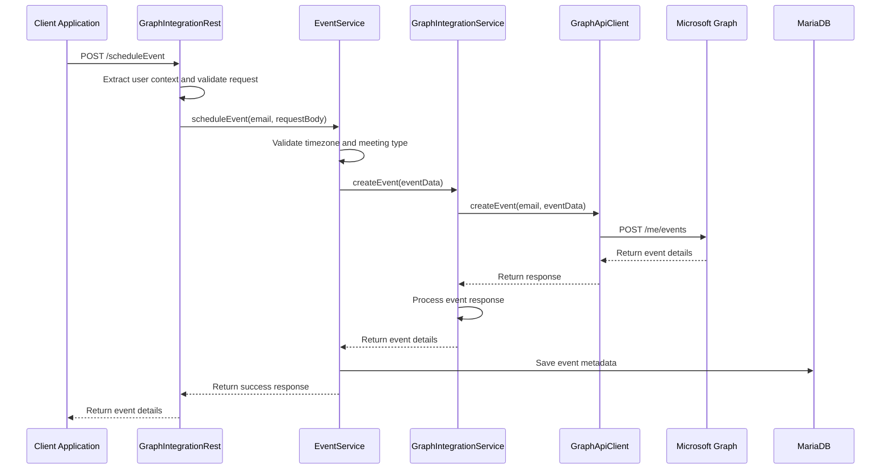

### Update Event Flow
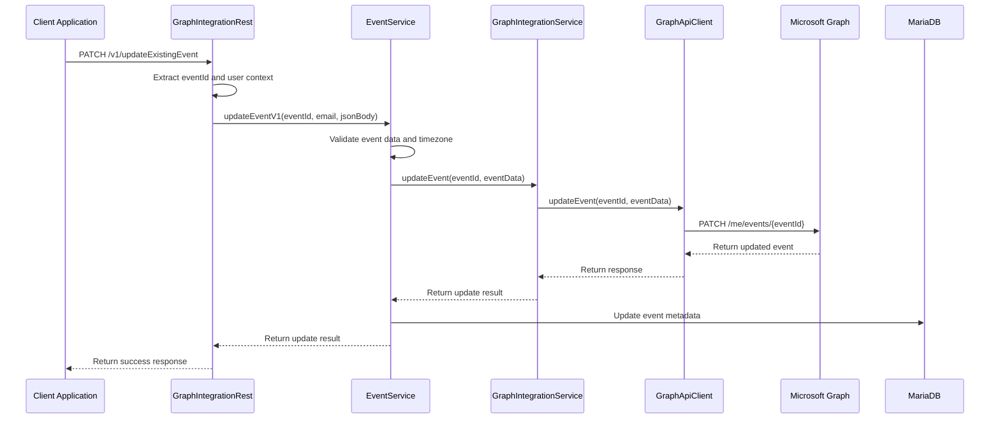

### Cancel Event Flow
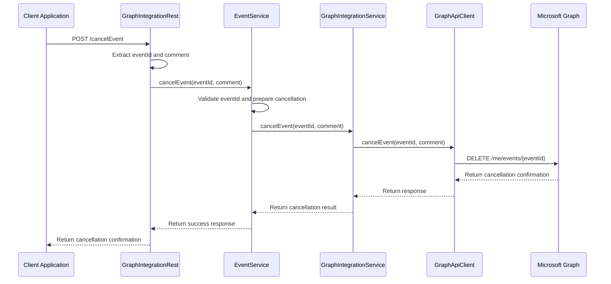

## Availability and Meeting Management Flow

### Get Available Meeting Slots Flow
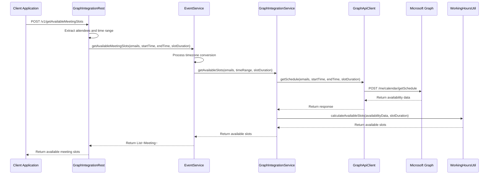

### Get Availability with Conflicts Flow
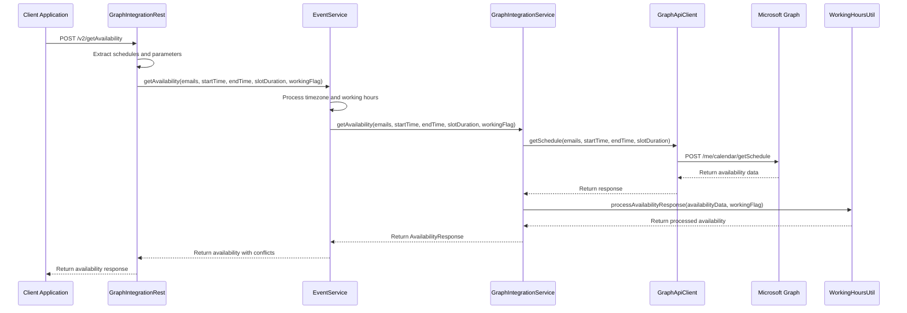

## User Management Flow

### Create User Flow
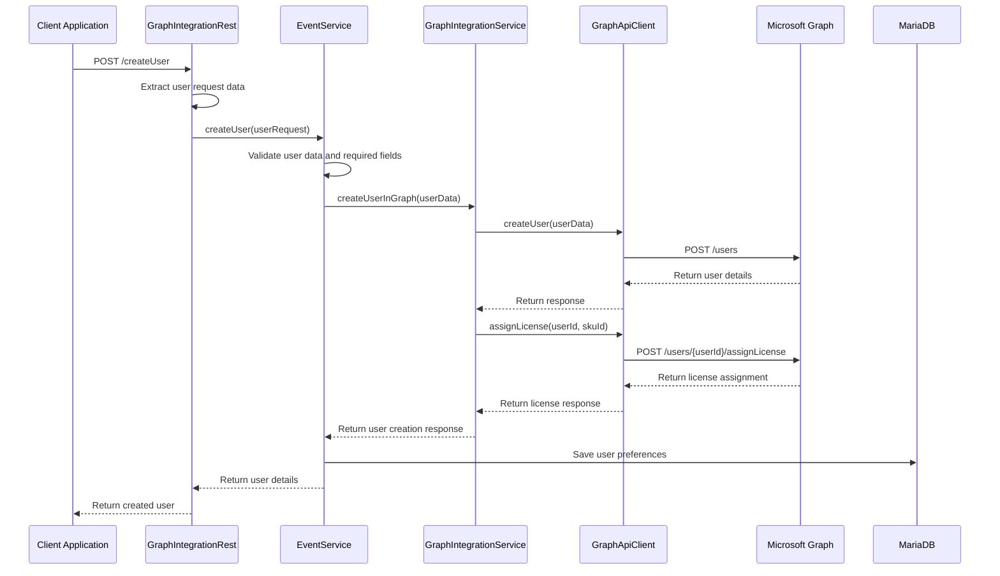

### Update User Details Flow
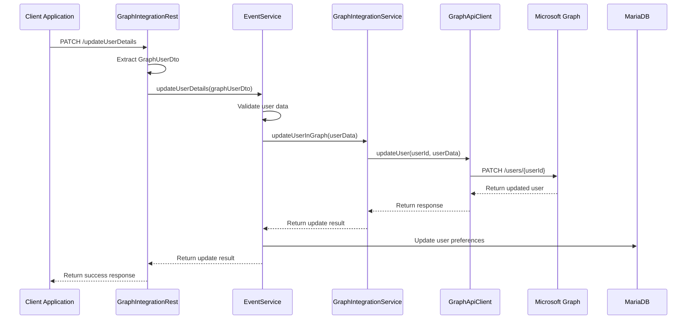

## Meeting Response Flow

### Accept Meeting Flow
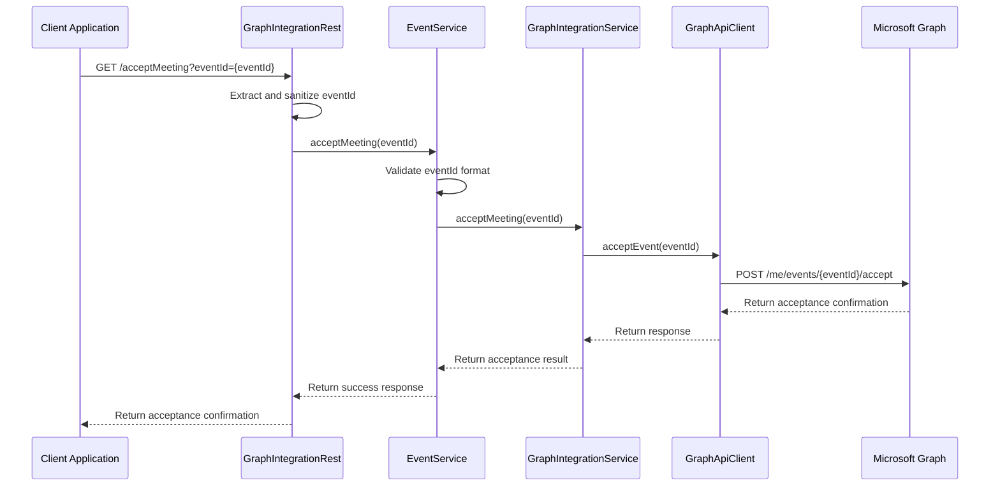

### Decline Meeting Flow
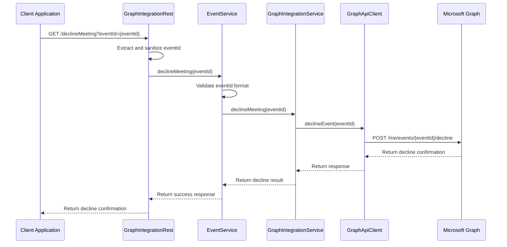

## Calendar Event Retrieval Flow

### Get Calendar Events Flow
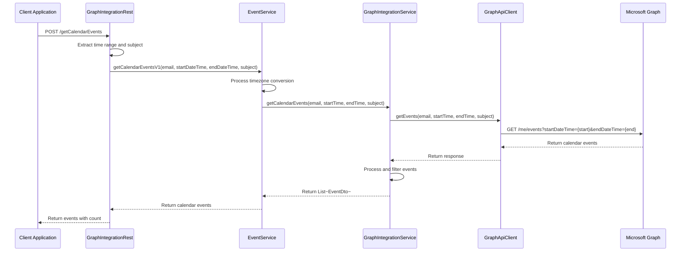

### Get Event Details Flow
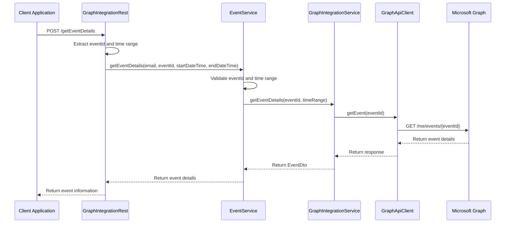

## Error Handling Flow

### Exception Handling and Recovery
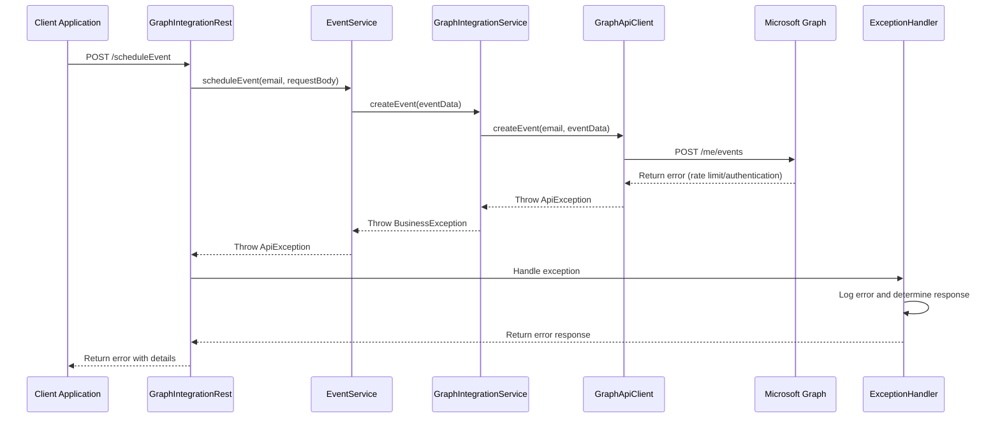

### Retry and Fallback Flow
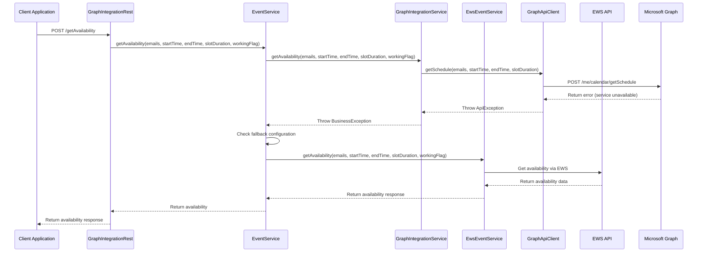

---

*These sequence diagrams illustrate the detailed flow of operations within the Email Agent, showing how different components interact to provide seamless email and calendar integration capabilities.*
