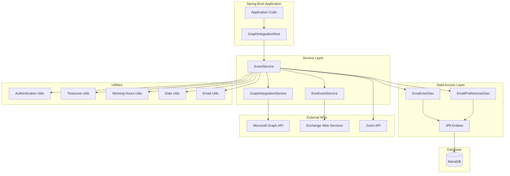
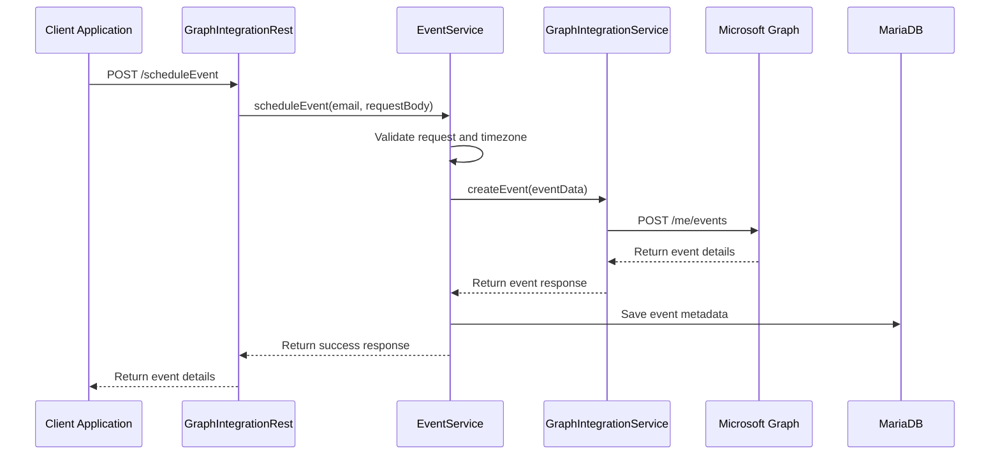
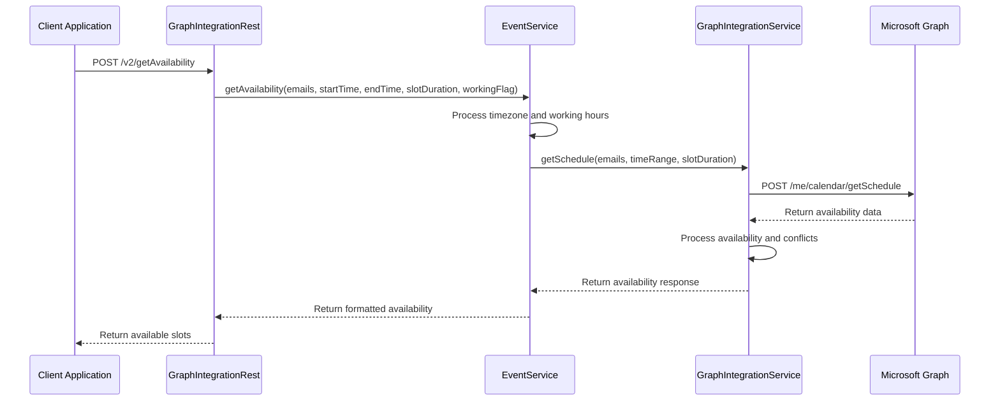
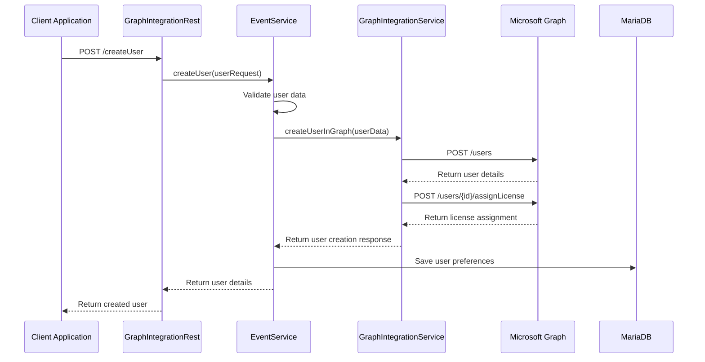

# 3.1 Architecture Diagram

This section contains the high-level architecture diagrams of the Email Agent microservice.

## System Architecture Overview

The Email Agent follows a layered architecture pattern with clear separation of concerns:

## Component Relationships

### REST Controller Layer
- **GraphIntegrationRest**: Primary REST controller for all email and calendar operations
- **API Documentation**: Swagger/OpenAPI annotations for comprehensive API documentation
- **Security Integration**: Role-based access control and authentication

### Service Layer
- **EventService**: Core interface for all event and calendar operations
- **GraphIntegrationService**: Microsoft Graph API integration service
- **EwsEventService**: Exchange Web Services integration service

### Data Access Layer
- **EmailUserDao**: User data access operations
- **EmailPreferencesDao**: User preferences and settings management
- **JPA Entities**: Data persistence with MariaDB

### External Integration Layer
- **Microsoft Graph API**: Modern calendar and user management
- **Exchange Web Services**: Legacy Exchange server integration
- **Zoom API**: Meeting creation and management

## Data Flow Architecture

### Calendar Event Management Flow

### Availability Checking Flow

### User Management Flow

## Key Architectural Principles

### 1. Separation of Concerns
- **REST Layer**: API endpoints and request/response handling
- **Service Layer**: Business logic and orchestration
- **Data Layer**: Data persistence and retrieval
- **Integration Layer**: External API communication

### 2. Dependency Injection
- All components are Spring-managed beans
- Loose coupling through interface-based design
- Easy testing and mocking capabilities

### 3. Caching Strategy
- **Token Caching**: OAuth tokens cached for performance
- **User Preferences**: User settings cached in memory
- **Configuration Caching**: External API configurations cached

### 4. Error Handling
- **Retry Logic**: Automatic retry with exponential backoff
- **Fallback Support**: Fallback between Graph API and EWS
- **Graceful Degradation**: Service continues with reduced functionality

### 5. Security Model
- **OAuth 2.0**: Secure authentication with Microsoft Graph
- **Role-Based Access**: Fine-grained permissions for different operations
- **Token Management**: Automatic token refresh and validation

## Integration Patterns

### 1. Microsoft Graph Integration
- **Authentication**: OAuth 2.0 with client credentials flow
- **API Calls**: RESTful API calls with proper error handling
- **Rate Limiting**: Respect for Microsoft Graph rate limits
- **Retry Logic**: Exponential backoff for transient failures

### 2. Exchange Web Services Integration
- **Authentication**: Basic authentication or modern auth
- **SOAP Calls**: EWS SOAP API for legacy Exchange servers
- **Error Handling**: Proper SOAP fault handling
- **Fallback Support**: Fallback to EWS when Graph API fails

### 3. Database Integration
- **JPA/Hibernate**: Object-relational mapping
- **Connection Pooling**: Efficient database connection management
- **Transaction Management**: ACID compliance for data operations
- **Query Optimization**: Efficient database queries

---

*This architecture ensures the Email Agent provides a robust, scalable, and maintainable solution for email and calendar integration in Spring Boot applications.*
