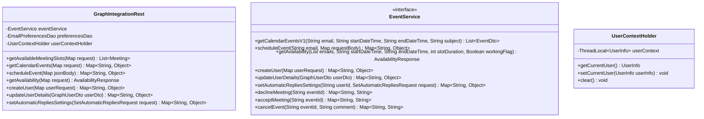
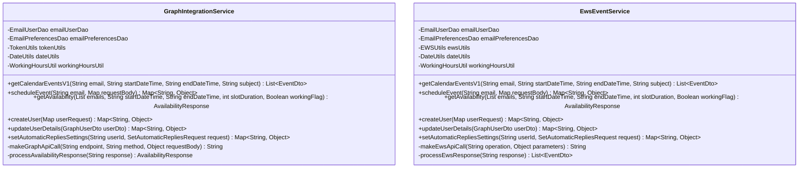
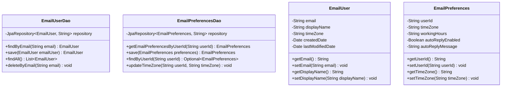
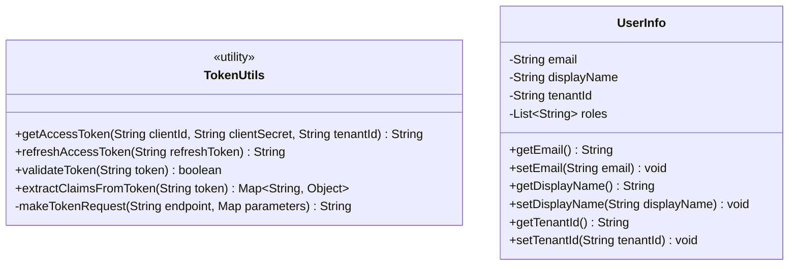
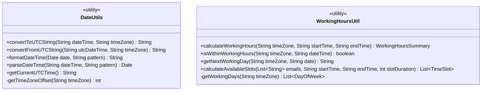
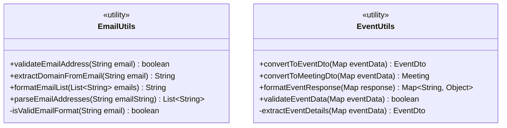
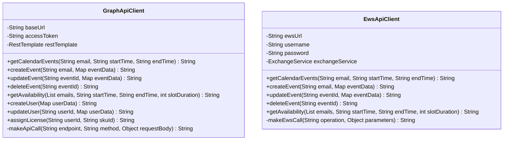
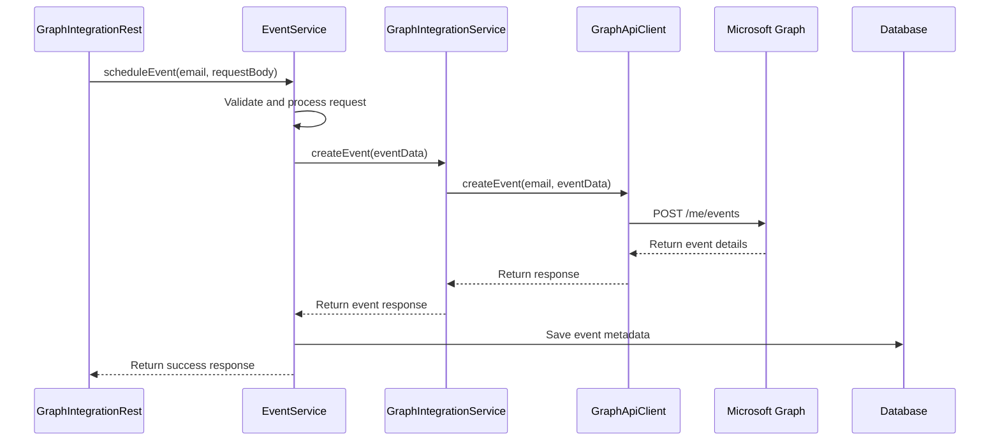
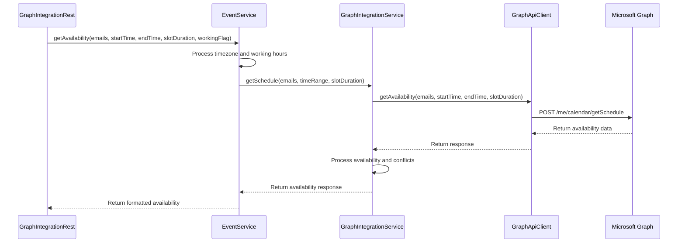

# 3.2 Component Diagram

This section contains detailed component diagrams of the Email Agent microservice.

## Core Components

### Primary Interface Components

### Service Implementation Components

## Data Access Components

### DAO and Entity Components

## Utility Components

### Authentication and Token Management

### Date and Time Management

### Email and Event Processing

## External Integration Components

### Microsoft Graph API Integration

## Component Interaction Patterns

### 1. Calendar Event Creation Pattern

### 2. Availability Checking Pattern

## Key Design Patterns

### 1. Service Layer Pattern
- **EventService**: Interface defining business operations
- **GraphIntegrationService**: Microsoft Graph implementation
- **EwsEventService**: EWS implementation

### 2. Data Access Object (DAO) Pattern
- **EmailUserDao**: User data access operations
- **EmailPreferencesDao**: Preferences data access operations
- **JPA Entities**: Data persistence objects

### 3. Factory Pattern
- **TokenUtils**: Creates and manages authentication tokens
- **DateUtils**: Creates formatted date/time objects
- **WorkingHoursUtil**: Creates working hours calculations

### 4. Strategy Pattern
- **GraphIntegrationService**: Microsoft Graph strategy
- **EwsEventService**: EWS strategy
- **Service Selection**: Based on configuration or availability

### 5. Template Method Pattern
- **GraphApiClient**: Common HTTP request handling
- **EwsApiClient**: Common EWS operation handling
- **Utility Classes**: Common processing patterns

---

*This component design ensures modularity, testability, and maintainability of the Email Agent while providing a clean separation of concerns.*
