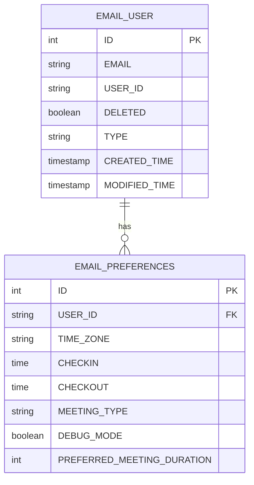

# 3.4 Database Schema

This section provides detailed database schema specifications for the Email Agent microservice.

## Database Overview

- **Database**: MariaDB 10.6+
- **ORM**: JPA/Hibernate with MySQL dialect
- **Connection Pooling**: HikariCP (Spring Boot default)
- **Naming Strategy**: PhysicalNamingStrategyStandardImpl

## Core Tables

### 3.4.1 EMAIL_USER Table

Primary table for user information and management.

```sql
CREATE TABLE EMAIL_USER (
    ID INT AUTO_INCREMENT PRIMARY KEY,
    BATCH_ID VARCHAR(255),
    EMAIL VARCHAR(255) NOT NULL,
    PHONE_NUMBER VARCHAR(20),
    TYPE VARCHAR(50) DEFAULT 'Office365',
    DELETED BOOLEAN DEFAULT FALSE,
    NAME VARCHAR(255),
    USER_OID VARCHAR(255),
    QUEUE_NAME VARCHAR(255),
    CREATED_TIME TIMESTAMP,
    MODIFIED_TIME TIMESTAMP,
    USER_ID VARCHAR(255)
);

-- Indexes
CREATE INDEX idx_email_user_email ON EMAIL_USER(EMAIL);
CREATE INDEX idx_email_user_user_id ON EMAIL_USER(USER_ID);
CREATE INDEX idx_email_user_deleted ON EMAIL_USER(DELETED);
CREATE INDEX idx_email_user_batch_id ON EMAIL_USER(BATCH_ID);
```

**JPA Entity Mapping:**
```java
@Entity
@Table(name = "EMAIL_USER")
public class EmailUser {
    @Id
    @GeneratedValue(strategy = GenerationType.IDENTITY)
    @Column(name = "ID")
    private Integer id;
    
    @Column(name = "EMAIL")
    private String email;
    
    @Column(name = "DELETED")
    private Boolean deleted = false;
    
    // ... other fields
}
```

### 3.4.2 EMAIL_PREFERENCES Table

User preferences and configuration settings.

```sql
CREATE TABLE EMAIL_PREFERENCES (
    ID INT AUTO_INCREMENT PRIMARY KEY,
    USER_ID VARCHAR(255) NOT NULL,
    EMAIL_SUBJECT VARCHAR(255),
    SENDER_COMPANY VARCHAR(255),
    IMPORTANT_TAGS TEXT,
    FONT_FAMILY VARCHAR(100),
    FONT_SIZE VARCHAR(10),
    EMAIL_SENDER VARCHAR(255),
    BLACK_LISTED_SENDER TEXT,
    BLACK_LISTED_DOMAIN TEXT,
    BLACK_LISTED_SUBJECT TEXT,
    TIME_ZONE VARCHAR(100),
    KEYBOARD_SHORTCUTS TEXT,
    CREATED_TIME TIMESTAMP,
    MODIFIED_TIME TIMESTAMP,
    CONVERSATION_ID VARCHAR(255),
    CONTACT_NUMBER VARCHAR(20),
    CHECKIN TIME,
    CHECKOUT TIME,
    FONT_COLOR VARCHAR(20),
    DISPLAY_NAME VARCHAR(255),
    MASK_CONTENT BOOLEAN DEFAULT FALSE,
    MEETING_TYPE VARCHAR(50) DEFAULT 'Teams',
    DEBUG_MODE BOOLEAN,
    ALLOW_NOTIFICATION BOOLEAN DEFAULT FALSE,
    DEVICE_ID VARCHAR(255),
    GCM_ID VARCHAR(255),
    ON_DEMAND_ENABLED BOOLEAN DEFAULT FALSE,
    PREFERRED_MEETING_DURATION INT,
    DATE_FORMAT VARCHAR(20) DEFAULT 'DD-MMM-YY',
    TIME_FORMAT VARCHAR(20) DEFAULT '24Hrs',
    IS_CATEGORY_ENABLED BOOLEAN DEFAULT TRUE,
    IS_PRIORITY_ENABLED BOOLEAN DEFAULT TRUE,
    IS_TONE_ENABLED BOOLEAN DEFAULT TRUE
);

-- Indexes
CREATE INDEX idx_email_preferences_user_id ON EMAIL_PREFERENCES(USER_ID);
CREATE INDEX idx_email_preferences_timezone ON EMAIL_PREFERENCES(TIME_ZONE);
```

**JPA Entity Mapping:**
```java
@Entity
@Table(name = "EMAIL_PREFERENCES")
public class EmailPreferences {
    @Id
    @GeneratedValue(strategy = GenerationType.IDENTITY)
    @Column(name = "ID")
    private int id;
    
    @Column(name = "USER_ID")
    private String userId;
    
    @Column(name = "TIME_ZONE")
    private String timeZone;
    
    @Column(name = "CHECKIN")
    private LocalTime checkin;
    
    @Column(name = "CHECKOUT")
    private LocalTime checkout;
    
    // ... other fields
}
```

## Data Access Layer

### 3.4.3 Repository Interfaces

**EmailUserDao:**
```java
@Repository
public interface EmailUserDao extends JpaRepository<EmailUser, Integer> {
    EmailUser findByEmail(String email);
    boolean existsByEmailAndNotDeleted(String email);
    List<EmailUser> findByBatchId(String batchId);
    List<EmailUser> findByDeletedFalse();
}
```

**EmailPreferencesDao:**
```java
@Repository
public interface EmailPreferencesDao extends JpaRepository<EmailPreferences, Integer> {
    EmailPreferences getEmailPreferencesByUserId(String userId);
    List<EmailPreferences> findByTimeZone(String timeZone);
    List<EmailPreferences> findByMeetingType(String meetingType);
}
```

## Database Configuration

### 3.4.4 Application Properties

```properties
# Database Configuration
spring.datasource.url=jdbc:mariadb://127.0.0.1:3306/email?autoReconnect=true&useSSL=false&allowPublicKeyRetrieval=true
spring.datasource.username=${MYSQL_USERNAME:root}
spring.datasource.password=${MYSQL_CHECKSUM:root}
spring.datasource.driver-class-name=org.mariadb.jdbc.Driver

# JPA Configuration
spring.jpa.database-platform=org.hibernate.dialect.MySQLDialect
spring.jpa.hibernate.ddl-auto=none
spring.jpa.hibernate.naming.physical-strategy=org.hibernate.boot.model.naming.PhysicalNamingStrategyStandardImpl
```

### 3.4.5 Connection Pool Settings

```properties
# HikariCP Configuration (Spring Boot defaults)
spring.datasource.hikari.maximum-pool-size=20
spring.datasource.hikari.minimum-idle=5
spring.datasource.hikari.idle-timeout=300000
spring.datasource.hikari.max-lifetime=1200000
spring.datasource.hikari.connection-timeout=20000
```

## Data Relationships

### 3.4.6 Entity Relationships



## Data Access Patterns

### 3.4.7 Common Queries

**Find Active Users:**
```java
@Query("SELECT u FROM EmailUser u WHERE u.deleted = false")
List<EmailUser> findActiveUsers();
```

**Find Users by Timezone:**
```java
@Query("SELECT u FROM EmailUser u JOIN EmailPreferences p ON u.userId = p.userId WHERE p.timeZone = :timezone")
List<EmailUser> findUsersByTimezone(@Param("timezone") String timezone);
```

**Soft Delete User:**
```java
@Modifying
@Query("UPDATE EmailUser u SET u.deleted = true, u.modifiedTime = :modifiedTime WHERE u.email = :email")
int softDeleteUser(@Param("email") String email, @Param("modifiedTime") Date modifiedTime);
```

## Performance Considerations

### 3.4.8 Indexing Strategy

- **Primary Keys**: Auto-increment integers for optimal performance
- **Foreign Keys**: Indexed for join operations
- **Search Fields**: Email, UserId, and Deleted status indexed
- **Time-based Queries**: Created/Modified time indexed for temporal queries

### 3.4.9 Query Optimization

- **Soft Deletes**: Use boolean flag instead of physical deletion
- **Batch Operations**: Support for bulk user creation and updates
- **Connection Pooling**: HikariCP for efficient connection management
- **Lazy Loading**: JPA lazy loading for related entities

---

*This database schema provides the foundation for user management and preferences storage in the Email Agent microservice.*
